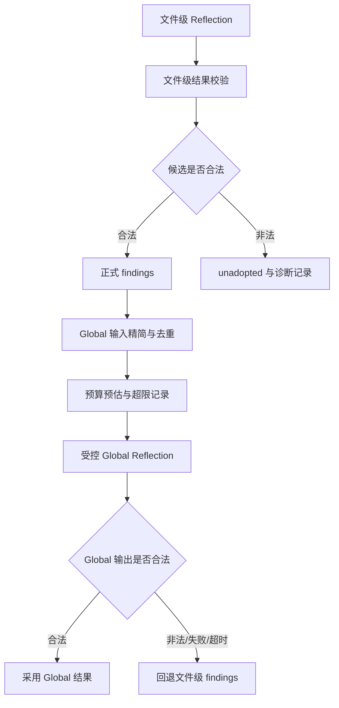

# Review Runtime Reliability 设计

- **Status:** Proposed
- 日期：2026-07-28
- 目标：修复文件级 Reflection 污染 Global Reflection、上下文预算失控和 `partial` 原因不可定位的问题。
- 触发 trace：`c8f46d72-b869-4553-a290-01cc2a9efadf`
- 关联设计：`docs/superpowers/specs/2026-07-27-review-trace-optimization-design.md`

## 1. 背景与问题

一次审查中，文件级 Reflection 可能生成不属于当前 Unit 的候选 finding，或者引用其他 Unit 的 evidenceId。例如：

1. `unit-config` 生成了 `hardcoded-jwt-secret`。
2. `unit-auth` 又生成同名 `hardcoded-jwt-secret`。
3. `unit-auth` 的候选引用了不存在于本 Unit 的 `reflection-evidence-1`。
4. Global Reflection 输入契约校验失败，最终只能回退到文件级结果并标记 `partial`。

同时，Global Reflection 当前输入包含完整的文件结果、候选、finding 和 Evidence 摘要，容易造成重复上下文。当前预算统计也没有完整覆盖 Global Reflection，导致诊断中的实际消耗被低估。

## 2. 目标与非目标

### 2.1 目标

1. 隔离非法文件级候选，不让单个候选拖垮整个 Global Reflection。
2. 确保 findingId 和 evidenceId 的 Unit 归属唯一且可验证。
3. Global Reflection 只消费合法、精简后的正式结果。
4. Global Reflection 超预算时继续执行一次受控调用，并记录预算超限。
5. Global Reflection 失败时保留合法文件级 findings。
6. 记录 ReAct、Reflection、Backfill、Global Reflection 的阶段级诊断信息。
7. 新增诊断字段兼容历史 session。

### 2.2 非目标

1. 不改变 finding 的业务含义和严重级别定义。
2. 不允许模型新增超出文件级结果的正式 finding。
3. 不引入新的数据库或远程服务。
4. 不改变 renderer IPC 的主要接口。
5. 不通过放宽 schema 来掩盖模型输出错误。

## 3. 设计原则

1. 文件级确定性校验优先于模型判断。
2. 正式 finding 以通过校验的文件级结果为准。
3. 非法候选隔离，不影响合法结果继续流转。
4. 预算超限是软降级信号，不是无条件跳过 Global Reflection 的理由。
5. Global 失败必须可回退，不能清空已验证结果。
6. Prompt 负责降低错误概率，代码负责最终安全边界。

## 4. 总体流程



## 5. 文件级 Reflection 结果隔离

### 5.1 正式结果来源

文件级校验完成后，建立当前 Unit 的确定性白名单：

```ts
const formalFindingIds = validatedFindings.map((finding) => finding.id);
const validEvidenceIds = evidenceBundle.items.map((item) => item.id);
```

候选只有同时满足以下条件，才可进入 Global 输入：

1. `candidate.finding.id` 属于当前 Unit 的正式 finding。
2. `candidate.evidenceIds` 全部属于当前 Unit 的 EvidenceBundle。
3. `candidate.finding.file` 等于当前 Unit 文件。
4. 当前 Unit 内 findingId 唯一。
5. finding 内容与已校验的正式 finding 一致。

### 5.2 非法候选处理

非法候选不再进入 Global Reflection，转为 `unadopted`：

```ts
type UnadoptedCandidateReason = {
  candidateId: string;
  unitId: string;
  reason:
    | "finding-id-not-allowed"
    | "finding-id-duplicate"
    | "evidence-id-not-owned"
    | "finding-content-mismatch"
    | "file-not-owned";
  evidenceIds: string[];
};
```

处理要求：

1. 合法 findings 继续参与 Global Reflection。
2. 非法候选保留在 `unadopted`，供 UI 和诊断查看。
3. 不因单个非法候选直接让整个 Global 输入失败。
4. 如果整个 Unit 无法确认唯一归属，才将该 Unit 标记为输入不完整。

## 6. Prompt 与代码双层边界

文件级 Reflection user message 增加白名单：

```json
{
  "allowedFindingIds": [
    "weak-password-validation",
    "long-token-expiry"
  ],
  "allowedEvidenceIds": [
    "unit-auth-evidence-1",
    "unit-auth-evidence-2"
  ]
}
```

Prompt 必须明确：

```text
candidate.finding.id 只能来自 allowedFindingIds。
禁止新增 finding 或复用其他 Unit 的 findingId。
evidenceIds 只能来自 allowedEvidenceIds。
禁止使用其他 Unit 或 reflection-backfill 产生的 evidenceId。
```

代码层仍必须执行完整校验，不能仅依赖 Prompt。

## 7. Global Reflection 输入模型

Global Reflection 接收精简投影，不再接收完整原始结果：

```ts
type GlobalReviewInput = {
  units: Array<{
    unitId: string;
    file: string;
    findings: Array<{
      id: string;
      severity: ReviewFinding["severity"];
      summary: string;
      explanation: string;
      suggestion: string;
      evidenceIds: string[];
    }>;
    evidence: Array<{
      id: string;
      checkId: string;
      source: EvidenceSource;
      summary: string;
    }>;
  }>;
};
```

Global 输入不包含：

1. 未通过校验的原始 candidates。
2. 完整 diff 内容。
3. 重复的完整 Evidence 内容。
4. 与 Global 决策无关的候选上下文。

Global Reflection 只能：

1. 合并同根因 finding。
2. 调整已有 finding 的 severity 或决策。
3. 标记冲突或需要人工复核的 finding。

禁止新增 finding、修改文件范围、修改行号或引用不存在的 evidenceId。

## 8. 预算策略

### 8.1 统计范围

统一累计以下阶段：

1. Plan。
2. ReAct。
3. 文件级 Reflection。
4. Reflection Backfill。
5. Global Reflection。

每个阶段记录：

```ts
type StageUsage = {
  inputTokens?: number;
  outputTokens?: number;
  modelCalls: number;
  toolCalls: number;
  readBytes?: number;
  durationMs: number;
  usageUnavailable?: boolean;
};
```

### 8.2 Global 软预算

Global Reflection 不因预算超限直接跳过：

1. 预估输入超限时记录 warning。
2. 仍执行一次 Global Reflection。
3. 使用独立最大执行时长和最大输出限制。
4. 成功则采用合法 Global 结果。
5. 失败或超时则回退文件级 findings。

预算超限只产生降级记录，不改变“继续调用一次”的策略。

## 9. Global 失败与回退

Global Reflection 失败包括：

1. schema 校验失败。
2. findingId 重复。
3. evidenceId 非法或跨 Unit 错配。
4. 新增 finding。
5. 修改文件、行号或问题范围。
6. provider 超时或调用异常。

失败后的处理：

```text
合法文件级 findings -> 保留
非法 Global candidates -> unadopted
Global 阶段 -> reflection-failed
Session -> partial
```

Global 结果不得覆盖或清空合法文件级 findings。

## 10. 阶段级诊断模型

新增可选的 `stageDiagnostics`：

```ts
type StageDiagnostic = {
  stage: "plan" | "react" | "reflection" | "backfill" | "global-reflection";
  unitId?: string;
  status: "completed" | "incomplete" | "failed" | "fallback";
  reason?: string;
  details?: Record<string, unknown>;
  usage?: StageUsage;
};
```

至少记录：

1. `stopReason`。
2. `missingCheckIds`。
3. `backfillRequested`。
4. 重复的 findingId。
5. 非法的 evidenceId。
6. 回退原因。
7. 阶段 token、调用次数和耗时。

最终 `degradationReasons` 保留，但每个原因必须能关联到 stage 和 unitId。

## 11. 持久化兼容

新增字段全部可选：

```ts
type ReviewSessionDiagnostics = {
  stageDiagnostics?: StageDiagnostic[];
  globalFallback?: {
    used: boolean;
    reason?: string;
  };
};
```

兼容规则：

1. 旧 session 缺少诊断字段时默认空数组。
2. 已有 findings、Evidence 和 session status 字段语义不变。
3. 新 schemaVersion 递增。
4. 旧 session 可以继续读取、展示和重跑。

## 12. 实施顺序

### P0：结果安全边界

1. 增加文件级 candidate 白名单校验。
2. 校验 evidenceId 的 Unit 归属。
3. Global 输入只使用合法正式 findings。
4. 非法候选写入 `unadopted`。
5. 增加重复 finding 和错配 evidence 回归测试。

### P1：预算与诊断

1. 统一累计所有阶段的 token 和调用数据。
2. Global 输入精简投影。
3. 实现 Global 软预算、硬超时和失败回退。
4. 持久化阶段级诊断。
5. 增加旧 session 兼容测试。

### P2：模型修复能力

1. Global 输出契约失败时增加一次受控修复重试。
2. 将非法候选和回退原因展示到诊断 UI。
3. 增加 trace replay 测试，覆盖 `c8f46d72-b869-4553-a290-01cc2a9efadf`。

## 13. 验收标准

1. 文件级 Reflection 生成重复 finding 时，Global 不再整体失败。
2. 错误 evidenceId 不会进入 Global 正式输入。
3. 非法候选可在 `unadopted` 中追踪。
4. Global 输入不再重复携带完整 diff 和原始 candidates。
5. Global 超预算时仍会执行一次受控调用。
6. Global 失败后合法文件级 findings 保留。
7. `partial` 可以定位到具体阶段、Unit 和原因。
8. 旧 session 可以正常读取。
9. 后端全量测试、类型检查和 trace replay 测试通过。
